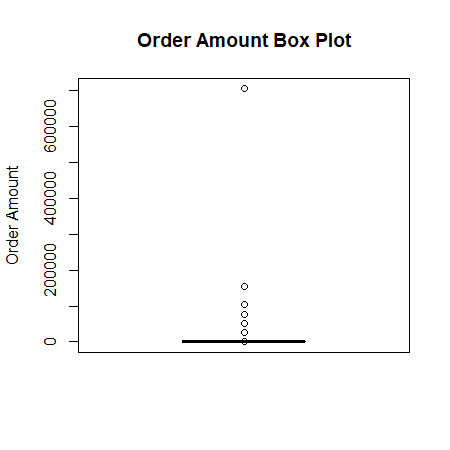
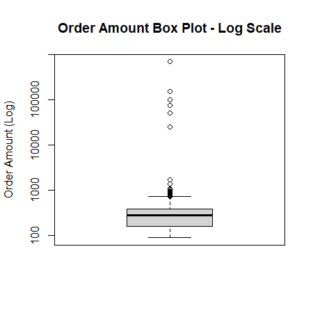
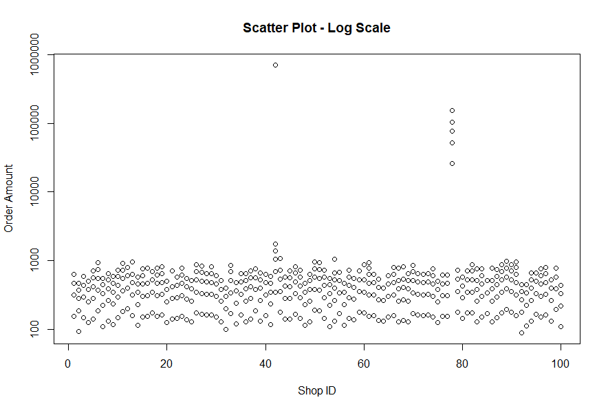
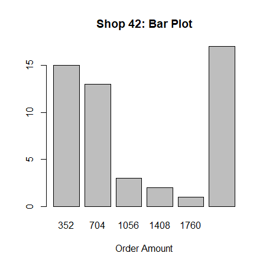
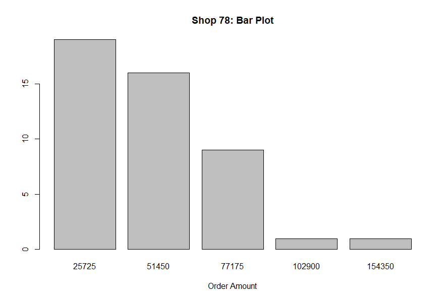

## Question 1: Base R
>> Note, this challenge was originally completed using tidyverse. However, Replit was unable to recognize the pipe operator (%>%). To submit the challenge with the requested link, the challenge was recoded in base r. 

### Summary of Answers
There are potentially two better metrics to use for reporting this data. 

- Solution 1: Median and Mode: **$284** and **$155**, respectively. As once quoted on a blog, *"When it comes to measures of central tendency (mean, median, mode), there is a saying in statistics: no measure of central tendency is best, but using only one is certainly the worst."* 
- Solution 2: Trimmed mean: **$277.65**
- High probability of fraud or data error for shops 42 and 78

### import dataset
```{r}
aov <- read.csv("~/AOV/2019 Winter Data Science Intern Challenge Data Set - Sheet1.csv")
```
### glimpse dataset 
```{r}
str(aov)
```

Initial findings: AOV is a dataset with 7 columns and 5,000 rows. As expected, it holds information on the order information, including shopper, store, customer id, and financial information on the payment method and order amount. Columns order_id, shop_id, and user_id have incorrectly been coded as integers. Let's change that to character. We'll leave created_at as character unless we need to perform date functions.  


```{r}
aov$order_id <- as.character(aov$order_id)
aov$shop_id <- as.character(aov$shop_id)
aov$user_id <- as.character(aov$user_id)
```


The first step is to recreate the AOV. We are assuming this is simply the overall average across all stores. We will also get the other measures of central tendencies too.

> Note: R does not have a built-in function to calculate mode, so we went to the internet, and luckily, someone made a function we can use. 

### function to calculate mode
```{r message = FALSE}
mode_val <- function(x) {
  value_counts <- table(x)
  max_count <- max(value_counts)
  index <- value_counts == max_count
  unique_values <- names(value_counts)
  result <- unique_values[index]
  no_mode <- length(value_counts) == length(result)
  if (no_mode) {
    result <- NA
  }
  result
}
```

### calculating mean, median, and mode
```{r}
mean(aov$order_amount)
median(aov$order_amount)
mode_val(aov$order_amount)
```

As expected, the AOV is **3145.12**. More telling, this measures greatly differs from the median and mode. The mean is susceptible to extreme values, there are likely some outliers in the data. A quick way to see what is going on is through visualizations. 

### univariate analysis: boxplot 
```{r}
boxplot(aov$order_amount,
  main = "Order Amount Box Plot",
  ylab = "Order Amount"
)
```



It's hard to tell much with this plot. Log transformation will be more helpful. 

```{r}
options(scipen = 5)
boxplot(aov$order_amount, log = "y", 
         main = "Order Amount Box Plot - Log Scale",
   ylab = "Order Amount (Log)")
```


The boxplot shows the order amounts on the y-axis. It's obvious to see we have some outliers! It seems that some expensive orders are skewing the AOV to the higher end. Let's explore these orders more closely. 

First, let's see where they're coming from using another visualization. 

### univariate analysis: histogram

```{r}
plot(aov$shop_id, aov$order_amount,
  log = "y", main = "Scatter Plot - Log Scale",
  xlab = "Shop ID", ylab = "Order Amount"
)
```


There are definitely a couple stores with high order amounts, but we can't pinpoint exactly which ones with the graph. We'll put the information in a table instead.  

```{r}
o_out=aggregate(aov$order_amount, list(shop_mean = aov$shop_id), mean)
o_out=o_out[order(-o_out$x),]
o_out[1:10,]
```

We can see that shops 42 and 78 have much higher order_amount averages than other stores. This exercise aims to calculate a better AOV, but we can't just ignore potential anomalies. Let's take a look at each of the stores in turn.  

## Investigation Begins

### closer look at shop 42
Shop 42 has the highest order amounts, nearly 5 times the amount of the second leading store (which itself has an unusually high average order amount!). We will subset this data to see if we can find an explanation. 

```{r}
f2= subset(aov, aov$shop_id == 42)
```

```{r}
counts <- table(f2$order_amount)
barplot(counts, 
      main="Shop 42: Bar Plot",
     xlab="Order Amount")
```


The order values were so disparate that we needed to log transform the plot. It seems as though shop 42 is making many high-end sales. Which raises the question, what is the cost of one item at this store?
  
average cost of shoes at stores not under investigation
```{r}
df= subset(aov, aov$shop_id != 42 | 78)
sum(df$order_amount) / sum(df$total_items)
```

average cost of shoes at store 42
```{r}
sum(f2$order_amount) / sum(f2$total_items)
```
The average cost of a shoe at store 42 is right in line with other stores. The cost per item is not what is tingling the spidey senses. Let's take a look at customers. 

```{r}
df=f2[order(-f2$order_amount, f2$created_at),]
df[1:10,]
```

So this table shows user 607 orders 2000 shoes and spending $704000... multiple times a week? 

This is highly unusual behaviour, especially considering that other users buy between 1-3 pairs of shoes. The orders are being placed simultaneously, and some even on the same day! Seventeen (17) orders totaling 34000 sneakers?

Either than is a bug in our database, or something fishy is going on here. 


total items sold by store
```{r}
df=aggregate(aov$total_items, by=list(shop_id=aov$shop_id), FUN=sum)
df=df[order(-df$x),]
df[1:10,]
```

Shop 42 is selling over 250 times the next leading store! It's clear something is going on, either in our dataset or at the shop. Let's move on to the other store that caught our attention. 

### closer look at shop 78 

We are on high alert for fraud. 

```{r}
f7= subset(aov, aov$shop_id == 78)
```

```{r}
counts <- table(f7$order_amount)

barplot(counts, 
      main="Shop 78: Bar Plot",
     xlab="Order Amount")
```



mean, median, and mode for shop 78
```{r}
mean(f7$order_amount)
median(f7$order_amount)
mode_val(f7$order_amount)
```


Now, this... this is a high-end sneaker store. The mode shows us that the most common price for a pair of shoes here is $25,725. Like with store 42, let's take a look at the customers. 

### customer order amounts for shop 78

```{r}
df=f7[order(-f7$order_amount, f7$created_at),]
df[1:10,]
```

```{r}
summary(f7$total_items)
mode_val(f7$total_items)
```

If we suspend belief and assume that $25,725 is not an outrageous price for shoes, the customer data is not raising red flags. There are 36 unique customers to the store and no-repeat customers (at least in the time frame of this dataset). The majority are buying 1 or 2 pairs (demonstrated by median and mode), the highest, 6. The timing of the purchases also doesn’t raise flags. 

This is not saying that something might not be wrong at this store. It is still worthwhile to see if this is an ultra-high-end sneaker store and not a decimal in the wrong place in our system!
  
### We got off track. Back to the questions at hand!
  
  Question 2. What metric would you report for this dataset?
  
  First, what is AOV? Searching Google brings up a Shopify Blog post on 'What is Average Order Value,’ which is very handy. The post includes a quote from Taylor Holiday, the co-founder of the marketing agency Common Thread Collective, Taylor Holiday. It reads _“When it comes to measures of central tendency (mean, median, mode), there is a saying in statistics: no measure of central tendency is best, but using only one is certainly the worst."_ 

### Solution 1: Other measures of central tendency.  
Since the mean has been 'compromised' by outliers that need to be investigated. 
Unlike the mean, the median is not susceptible to extreme values. The mode may also be a good indicator. Using both is best.  

- **Median: $284**

- **Mode: $155 **

### Solution 2: Removing Outliers using Trimmed Mean 
We might get a better mean if we remove the outliers. However, we can't simply remove the top extremes values without removing values from the other end. Trimming the mean, we get a metric of **$277.65**

```{r}
mean(aov$order_amount)
mean(aov$order_amount, trim = 0.3)
```


The trimmed mean of **$277.65** is more in line with our median and mode. It, along with others, can be reported. 
